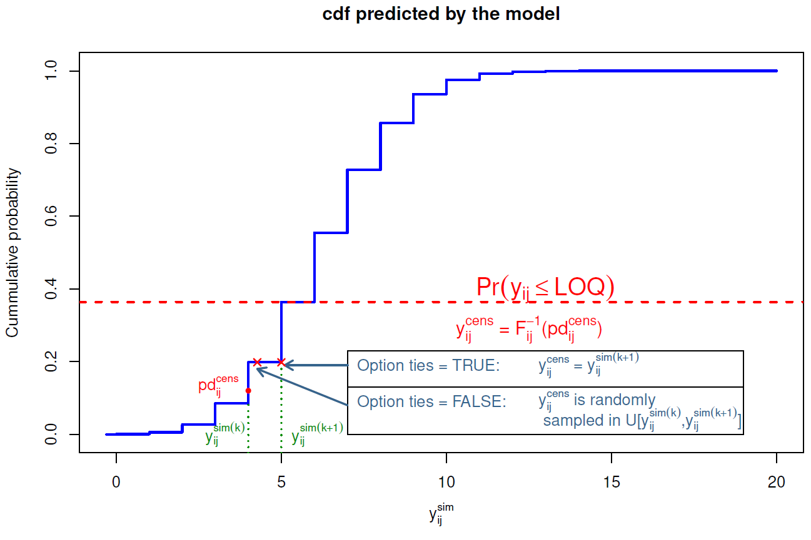

# Statistical methods {#statisticalMethods}

<!-- ########################################################################################################## -->

## Models and notations

<!-- ########################################################################################################## -->

Let $i$ denote the i$^{\rm th}$ individual ($i$ = 1,$\dots$, N) and $j$ the j$^{\rm th}$ measurement in an individual ($j$ = 1,$\dots$, n$_i$, where n$_i$ is the number of observations for subject $i$). Let $\Y_i$=$\{y_{i_1},\dots,y_{i_{n_i}} \}$ be the n$_i$-vector of observations observed in individual $i$. Let the function $f$ denote the nonlinear structural model. $f$ can represent for instance the pharmacokinetic model. The statistical model for the observation $y_{ij}$ in patient $i$ at time $t_{ij}$, is given by:

\begin{equation}
y_{ij}=f(t_{ij},\theta_i)+\varepsilon_{ij}
\end{equation}

where $\theta_i$ is the p-vector of the individual parameters and $\epsilon_{ij}$ is the residual error, which is assumed to be normal, with zero mean. The variance of $\varepsilon_{ij}$ may depend on the predicted concentrations $f(t_{ij},\theta_i)$ through a (known) variance model. Let $\sigma$ denote the vector of unknown parameters of this variance model.

In pharmacokinetic (PK) $\normalsize{/}$ pharmacodynamic (PD) studies for instance, it is usually assumed that the variance of the error follows a combined error model:

\begin{equation}
\Var(\varepsilon_{ij})= (\sigma_{\rm inter} + \sigma_{\rm slope} f(t_{ij},\theta_i))^2 (\#eq:errormod)
\end{equation}

where $\sigma_{\rm inter}$ and $\sigma_{\rm slope}$ are two parameters characterising the variance. In this case, $\sigma=(\sigma_{\rm inter},\sigma_{\rm slope})$. This combined variance model covers the case of an homoscedastic variance error model, where $\sigma_{\rm slope}=0$, and the case of a constant coefficient of variation error model when $\sigma_{\rm inter}=0$. Another parametrisation often found is:

\begin{equation}
\Var(\varepsilon_{ij})= \sigma_{\rm inter}^2 + \sigma_{\rm slope}^2 \;
f(t_{ij},\theta_i)^2
\end{equation}

Another usual assumption in population PK/PD analyses is that the distribution of the individual parameters $\theta_i$ has a known shape, for instance the normal, log-normal or logit distribution. Following the model structure laid out in the <http://wiki.webpopix.org/index.php/What_is_a_model%3F_A_joint_probability_distribution!>, we will assume a transformation $h$ can be used to transform a linear function of the fixed effects $\mu$, the vector of covariates $\mathrm{X}_i$ and the random effects $\eta_i$, into the vector of individual parameters for individual $i$, $\theta_i$:
\begin{equation}
\theta_i=h(\mu, X_i \eta_i) (\#eq:modelPKcov)
\end{equation}
where the $\eta_i$ are assumed to follow a normal distribution $\mathcal{N} (0, \Omega)$, with $\Omega$ the variance-covariance matrix of the random effect. Other parametric or non-parametric assumptions can be used for the distribution of the random effects, as in the first paper using this method, in the context of non-parametric estimation [@Mesnil98]. Although npde were developed in the context of pharmacokinetic and pharmacodynamic analyses, it is a general approach that can be used to evaluate mixed effect models. The key assumption is to be able to simulate from the expected model, and the npde are designed to test whether simulations and observations correspond.

We denote ${\rm \Psi}$ the vector of population parameters (also called hyperparameters) estimated using the data in a learning dataset B: ${\rm \Psi}= (\mu, \Omega,\sigma)^{\top}$.  We call M$^B$ the model defined by its structure (function $f$, distributions $h$, and variance model) and by the hyperparameters $\widehat{\rm \Psi}^B$ estimated from the learning dataset B.

<!-- ########################################################################################################## -->

## Computing pde and npde

<!-- ########################################################################################################## -->


Let V a validation dataset. Evaluation methods compare the predictions obtained by M$^B$, using the design of V, to the observations in V. V can be the learning dataset B (internal validation) or a different dataset (external validation). The null hypothesis (H$_0$) is that data in the validation dataset V can be described by model M$^B$. Prediction discrepancies and prediction distribution errors are metrics designed to test this assumption.

<!-- ########################################################################################################## -->

### Prediction discrepancies (pd)

<!-- ########################################################################################################## -->

Let p$_{i}(y|\Psi)$ be the whole marginal posterior predictive distribution of an observation $y$ for the individual \emph{i} predicted by the tested model. p$_i$ is defined as:
$$p_{i}(y|\Psi)=\int p(y|\theta_{i},\Psi) p(\theta_{i}|\Psi)d\theta_{i}$$

Let $F_{ij}$ denote the cumulative distribution function (cdf) of the predictive distribution p$_{i}(y|\Psi)$. The prediction discrepancy for an observation is defined as the corresponding value of the cdf, as given by:

$$\pd_{ij}=F_{ij}(y_{ij})=\int^{y_{ij}} p_{i}(y|\Psi)dy=\int^{y_{ij}}\int p(y|\theta_{i},\Psi)p(\theta_{i}|\Psi)d\theta_{i}dy$$

In NLMEM, $F_{ij}$ has no analytical expression and can be approximated by simulations. Using the design of the validation dataset V, we simulate $K$ datasets $\V^{sim(k)}$ ($k$=1,$\dots$,K) under model M$^B$. Let $\Y_i^{sim(k)}$ denote the vector of simulated observations for the $i^{\rm th}$ subject in the $k^{\rm th}$ simulation.

The prediction discrepancy $\pd_{ij}$ for observation $y_{ij}$ can then be computed from the cdf $F_{ij}$, as:
\begin{equation}
\pd_{ij} = F_{ij}(y_{ij}) \approx \frac{1}{K}{\displaystyle{\sum_{k=1}^{K}}\mathbb{1}_{  \Big\{y_{ij}^{sim(k)}<y_{ij}  \Big\}}} (\#eq:pdedef)
\end{equation}

To handle extreme values of the observations (defined as values smaller or larger than all the simulated values y$_{ij}^{sim(k)}$), we further set:
\begin{equation*}
\pd_{ij} = \left\{ \begin{array}{l r}
            \frac{1}{2K} & \text{if } y_{ij} \leq y_{ij}^{sim(k)} \; \forall \; k=1,\ldots,K \\
            1-\frac{1}{2K} & \text{if } y_{ij} > y_{ij}^{sim(k)} \; \forall \; k=1,\ldots,K \\
           \end{array}
\right.
\end{equation*}
Under H$_0$, if $K$ is large enough, prediction discrepancies $\pd$ follow $\mathcal{U}(0, 1)$ by construction.

This processs is described in the figure below:

<!-- # ```{r  fig.cap='Building prediction discrepancies', out.width='80%', fig.asp=.75, fig.align='center', echo=FALSE} -->
<!-- # knitr::include_graphics("figures/buildingNpde.eps") -->
<!-- # ``` -->

### Smoothing the distribution

The simulation-based computation described above can lead to ties especially at the extremes, that is, different observations may have the same value of $\pd$ (this occurs particularly often if the number of simulations is small, or the model is quite different from the data). To avoid this issue, we have implemented an option to smooth the distribution: instead of using directly the quantile of the observation within the simulated distribution, as in equation \@ref(eq:pdedef), we draw the $\pd$ randomly between this quantile (say $k/K$) and the one immediately above ($(k+1)/K$). We do this by adding a sample from a uniform distribution over the interval $\left[0,\frac{1}{K}\right]$ to the value defined by the previous equation:
\begin{equation}
\pd_{ij} = u_{ij} + \frac{1}{K}{\displaystyle{\sum_{k=1}^{K}}\mathbb{1}_{  \Big\{y_{ij}^{sim(k)}<y_{ij}  \Big\}}} 
\end{equation}
Again, extreme values of the observations are treated separately:
\begin{equation*}
\pd_{ij} \sim \left\{ \begin{array}{l r}
            U \left[ 0,1/K\right] & \text{if } y_{ij} \leq y_{ij}^{sim(k)} \; \forall \; k=1,\ldots, K \\
            U[1-1/K,1] & \text{if } y_{ij} > y_{ij}^{sim(k)} \; \forall \; k=1,\ldots, K \\
           \end{array}
\right.
\end{equation*}

<!-- This option can be set by using the ```ties=FALSE``` argument. -->

<!-- ########################################################################################################## -->

### Normalised prediction distribution errors (npde)

<!-- ########################################################################################################## -->

When multiple observations are available for one subject, typically in population analyses, the $\pd$ are correlated within each subject, leading to an inflation in the type I error of tests comparing the distribution of the $\pd$ to their theoretical distribution (@Mentre06). To correct for this correlation, we compute the mean $\mathbb{E}(\Y_i)$ and variance $\Var(\Y_i)$ of the $K$ simulations (@Brendel06). The mean is approximated by:
$$\mathbb{E}(\Y_{i})\thickapprox\frac{1}{K}\overset{K}{\underset{k=1}{\sum}}\Y_{i}^{sim(k)}$$
and the variance-covariance matrix is approximated by:
$$\Var(\Y_{i})\thickapprox \frac{1}{K}\overset{K}{\underset{k=1}{\sum}}(\Y_{i}^{sim(k)}-\mathbb{E}(\Y_{i}))(\Y_{i}^{sim(k)}-\mathbb{E}(\Y_{i}))^{\top}$$
Decorrelation is performed simultaneously for simulated data:
$$ \Y_{i}^{sim(k)*}= \Var(\Y_i)^{-1/2} (\Y_{i}^{sim(k)}-\mathbb{E}(\Y_i))$$
and for observed data:
$$ \Y_{i}^*= \Var(\Y_i)^{-1/2} (\Y_{i}-\mathbb{E}(\Y_i))$$
Since we are looking to obtain 'residuals', different decorrelation options exist to obtain $\Var(\Y_i)^{-1/2}$, corresponding to different sets of decorrelated data. In the **npde** package, we propose 3 options, which will be detailed in the next section \@ref(decorrelation).

Decorrelated $\pd$ are then obtained using the same formula as \@ref(eq:pdedef) but with the decorrelated data, and we call the resulting variables prediction distribution errors ($\pde$):
\begin{equation}
\pde_{ij} = F^*_{ij}(y^*_{ij})
\end{equation}

Under H$_0$, if $K$ is large enough, the distribution of the prediction distribution errors should follow a uniform distribution over the interval [0,1] by construction of the cdf. Normalized prediction distribution errors ($\npde$) can then be obtained using the inverse function of the normal cumulative density function implemented in most software:
\begin{equation}
\npde_{ij} = \Phi^{-1} (\pde_{ij})
\end{equation}

By construction, if H$_0$ is true, $\npde$ follow the $\mathcal{N}(0, 1)$ distribution and are uncorrelated within an individual. The decorrelation step however does not make the $\npde$ truly independent, since this is only valid for Gaussian variables and here the model nonlinearity makes this only approximately true (@Comets10).

<!-- ########################################################################################################## -->

## Decorrelating the data to obtain $\pde$ {#decorrelation}
 
### Decorrelation methods

To calculate the matrix $Var(\Y_i)^{-1/2}$ used for decorrelating data, we can use different methods.

The Cholesky decomposition is a standard way to obtain residuals in regression models, and was used in the initial implementation of the **npde** library. It is computationally simple, numerically stable, and remains the default method. However, as an iterative pivotal algorithm it is sensitive to the ordering of the vector of $\Y_i$. In PK or PD applications, time imposes a natural order on the vector of longitudinal observations which makes this method very relevant, however this may not be as simple for instance when there are multiple responses. The Cholesky decomposition method is also used in the proc MIXED of SAS, to calculate residuals for correlated data. Let $\mathrm{C}$ denote the Cholesky root of $\Var(\Y_i)$ so that 
$$\mathrm{C}^{\top}\mathrm{C} = \Var(\Y_i)$$
Then $\Var(\Y_i)^{-1/2} = (\mathrm{C}^{\top})^{-1}$. 

Using a Cholesky decomposition is not the only way to define residuals. An alternative which is invariant to re-ordering of the vector of observations is to use the unique square root of the matrix $\Var(\Y_{i})$, obtained using an eigenvalue decomposition. The matrix $\Var(\Y_i)$ can be factorized as: 
$$\Var(\Y_{i})= \mathrm{Q} \Lambda \mathrm{Q}^{-1}$$
where Q is the square matrix of the same dimension of $Var(\Y_i)$, whose i$^{\rm th}$ column is the eigenvector of $\Var(\Y_i)$ and $\Lambda$ is the diagonal matrix whose diagonal elements are the corresponding eigenvalues. The square root matrix of $Var(\Y_i)$ is then calculated as: 
$$\Var(\Y_i)^{1/2} = \mathrm{Q} \Lambda^{1/2} \mathrm{Q}^{-1}$$
and this square root matrix is inverted to calculate the matrix $\Var(\Y_i)^{-1/2}$. This method is currently implemented in MONOLIX 4 and NONMEM 7 to calculate weighted residuals (WRES, IWPRES) and **npde**. However, when calculating the symmetric square root from the eigen value-eigen vector decomposition, we will essentially be defining principle directions determined by the variance-covariance matrix and thus, the decorrelated observations$\normalsize{/}$residuals are rotated and no longer correspond to the natural ordering.

We have also implemented a third method, combining a Cholesky decomposition with a polar decomposition~\cite{Higham86}. Let $\mathrm{C}$ denote the Cholesky root of $Var(\Y_i)$. Using polar decomposition, the matrix $\mathrm{C}$ can be factorized as: $\mathrm{C} = \mathrm{U} \mathrm{H}$, where U is a unitary matrix and H is a positive-semidefinite Hermitian matrix. The square root matrix of $Var(\Y_i)$ is then calculated as: 
$$\Var(\Y_i)^{1/2} = \mathrm{U}^{\top} \mathrm{C}$$
This square root matrix is then inversed to calculate the matrix $\Var(\Y_i)^{-1/2}$.

### Choosing a decorrelation method

The Cholesky method was the only option available in the previous version of the library (**npde** 1.2) and is implemented as the default method in the current version (**npde** 2.0). Choosing the decorrelation method is done using the ```decorr.method="" ```  option, with the following choices:

i.```decorr.method="cholesky" ```: Cholesky decomposition (pseudo-inverse obtained by the ```chol ``` function)

ii.```decorr.method="inverse" ```: Inverse (unique inverse, obtained using the ```eigen ``` function)

iii.```decorr.method="polar" ```: polar decomposition (pseudo-inverse obtained by combining the ```chol``` function with the ```svd ``` function)

**Note** The user needs to be aware that sometimes the decorrelation step (regardless of the method chosen to perform it) will induce or mask patterns in the graphs of **npde** versus time or predictions. When strange patterns are seen, we advise the user to also look at the $\pd$ graphs, which do not involve the decorrelation step, to ascertain whether these patterns are really due to model misspecification and not an artefact of the decorrelation step, and/or to test different decorrelation methods.


<!-- ########################################################################################################## -->

## Censoring methods

**npde** have been extended to censored data below the quantification limit in @Nguyen12. Additional extensions have been proposed for time-to-event data (right and interval-censored); these new extensions have not yet been integrated within the package and are available on the development github <https://github.com/ecomets/npde30>.

The npde package provides several methods to handle censoring.

### Choosing the method to handle BQL data 

BQL data means that we do not observe $y_{ij}$ directly, but that we know the observation to be below a censoring value. We restrict ourselves to data below the LOQ, although extension to interval-censored data is straightforward. BQL data in the validation dataset can be treated in different ways:

1. removed from the dataset: option```cens.method = "omit"```
2. imputed to model predictions: population predictions (option ```cens.method = "ppred"```) or individual predictions (option ``` cens.method = "ipred"```)

    * with the ```ppred``` method, population predictions are computed using the simulated datasets. For observation $y_{ij}$, the population prediction is $\mathbb{E}_k \Big(y^{sim(k)}_{ij}\Big)$.
    * with the ```ipred``` method, individual predictions for each observation obtained during the estimation process need to be included in the data file as an additional column
    * $\pd$ and $\npde$ are computed after replacing observed and simulated data by the imputed values

3. imputed to a fixed value: to LOQ (option ```cens.method = "loq"```) or to a value chosen by the user (option```cens.method = "fixed"```,```loq=LOQ``` where LOQ is a number)

    * as in the previous method, $\pd$ and $\npde$ are computed after replacing observed and simulated data by the imputed values

Sometimes the data includes different LOQs (for instance when the dataset pools several studies with different analytical methods). In this case, the program computes the smallest LOQ in the dataset, and this value is used to censor the simulated data (eg, any simulated value in the dataset lower than the LOQ is omitted or replaced using the imputation method chosen).

Note that all methods involve some loss of power, all the more important when the fraction of BQL data is large, and thus conclusions must be made with prudence when using these imputation methods. However, simulations show that the  ```cens.method = "cdf"``` is the most suitable (@Nguyen12), and that methods imputing directly with a fixed value or with population model predictions have a poor performance.

### Imputation of BQL data using the cumulative distribution function

For an observation above LOQ ( Limit Of Quantification ), the $\pd$ is computed as described above, as the quantile of the observation within the predicted distribution. For a BQL observation (left-censored observation) $y^{cens}_{ij}$ of the i$^{\rm th}$ individual at time $t_{ij}$, we first evaluate its probability of being under LOQ $\mathbb{P}(y_{ij}^{cens} \leq {\rm LOQ})$ using the predictive distribution predicted from the model:
\begin{equation}
\mathbb{P}(y_{ij}^{cens}\leq\mbox{LOQ})=F_{ij}(\mbox{LOQ})=\frac{1}{K}{\displaystyle{\sum_{k=1}^{K}}\mathbb{1}_{\bigg\{y_{ij}^{sim(k)}\leq\text{LOQ}\bigg\}}}
\end{equation}
(these predicted probabilities are stored and returned in the results, see section \@ref(npde.methods). Since we only know that the actual observation is below $\text{LOQ}$, we propose to compute the $\pd$ for a left-censored observation y$_{ij}^{cens}$, pd$_{ij}^{cens}$, as a random sample from a uniform distribution over the interval $$\big[0, \mathbb{P}\big(y_{ij}^{(cens)} \leq {\rm LOQ}\big)\big]$$
To obtain the $\npde$ however, we first need to also impute observations which are below LOQ. We transform the imputed $\pd$ back to an imputed observation using the inverse function of the predictive distribution function $F_{ij}$:
\begin{equation}
y_{ij}^{cens(new)}=F_{ij}^{-1}(pd_{ij}^{cens})
\end{equation}
Since $\pd$ are quantiles, this corresponds to finding the quantile immediately after the imputed $\pd_{ij}$ and setting $y_{ij}^{cens(new)}$ to the value in the simulated distribution $F_{ij}$ corresponding to that quantile (see figure fig:imputation03 for an illustration). The new vector of observations $\Y_{i}^{new}$ now contains both observed values, for non censored data, and imputed values for censored data.

<!-- ```{r  fig.cap='Imputation for BQL data with or without ties', out.width='50%', fig.asp=.5, fig.align='center', out.extra='angle=270', echo=FALSE} -->
<!-- knitr::include_graphics("figures/imputation.eps") -->
<!-- ``` -->

We cannot simply decorrelate the vector of observed data $y_{i}$ using the simulations from the model, because the simulated dataset also contains values that would have been censored and treating them as simulated. We therefore propose to impute these censored data to a value between 0 and $\text{LOQ}$ using the same method. We impute a pd$_{ij}^{sim^{(new)}(k)}$ for each y$_{ij}^{sim(k)}$ below $\text{LOQ}$ in the simulated data and these y$_{ij}^{sim(k)}$ are replaced using the same imputation method applied to the observed data.
\begin{equation}
y_{ij}^{sim^{(new)}(k)}=F_{ij}^{-1}(pd_{ij}^{sim^{(new)}(k)})\,\,\,\mbox{if }y_{ij}^{sim}\leq \text{LOQ}
\end{equation}

As previously, to avoid ties in the $\pd$ and $\npde$, we can jitter the imputed $\pd$ and $y$. Figure \@ref{fig:imputation03} shows an illustration for both cases:

i. method ```ties = TRUE```: if $F_{ij}(y_{ij}^{sim(k)}) < pd_{ij}^{cens}\leq F_{ij}(y_{ij}^{sim(k+1)})$, then $y_{ij}^{cens} = y_{ij}^{sim(k+1)}$
ii. method ```ties = FALSE```: if $F_{ij}(y_{ij}^{sim(k)}) < pd_{ij}^{cens}\leq F_{ij}(y_{ij}^{sim(k+1)})$, then $y_{ij}^{cens}$ is randomly sampled in a uniform distribution over the interval $\bigg[ y_{ij}^{sim(k)},y_{ij}^{sim(k+1)} \bigg]$

```{r fig:imputation03, echo=FALSE, fig.align = 'center', out.width="80%", fig.caption ='Imputation with the two options ties = TRUE and ties = FALSE ' }

```

After the imputation step, a new vector of observations $\Y_{i}^{(new)}$ and new simulated data $\Y_{i}^{sim^{(new)}}$ are obtained. The complete data are then decorrelated using the same technique as described above. Note that the matrix $\Var(\Y_i)$ used to decorrelate is computed using the imputed data, while the predictive distribution functions $F_{ij}$ are computed using the original simulated data before the imputation step.

<!-- ########################################################################################################## -->

## Tests

### Tests on the distribution of npde

<!-- ########################################################################################################## -->

Under the null hypothesis that model M$^B$ describes adequately the data in the validation dataset, the $\npde$ follow the $\mathcal{N}(0, 1)$ distribution. We report the first three central moments of the distribution of the $\npde$: mean, variance, skewness, as well as the kurtosis, where we define kurtosis as the fourth moment minus 3 so that the kurtosis for $\mathcal{N}(0,1)$ is 0 (sometimes called excess kurtosis). The expected value of these four variables for the expected $\mathcal{N}(0,1)$ are respectively: 
mean = 0, 
variance = 1, 
skewness = 0,
kurtosis - 3 = 0. 

The program also reports the standard errors for the mean (SE=$\sigma/\sqrt{N}$) and variance (SE=$\sigma\;\sqrt{2/(N-1)}$).

We use 3 tests to test the assumption that the $\npde$ follow the $\mathcal{N}(0, 1)$ distribution: 

i. a Wilcoxon signed rank test, to test whether the mean is significantly different from 0,
ii. a Fisher test for variance, to test whether the variance is significantly different from 1,
iii. a Shapiro-Wilks test, to test whether the distribution is significantly different from a normal distribution. 

The package also reports a global test, which consists in considering the 3 tests above with a Bonferroni correction (@Brendel10). The p-value for this global test is then reported as the minimum of the 3 p-values multiplied by 3, the number of simultaneous tests (or 1 if this value is larger than 1) (@Wright92). A graphical code is used in the library to highlight significant results, similar to the code used by other statistical functions in R such as **lm** (see example). The normality test is very powerful, especially with large amount of observations. When the test remains significant even after model refinement, QQ-plots should be used to assess model adequacy in addition to the 3 statistical tests. This is especially useful in large datasets where the sheer amount of data will lead to reject even reasonable models.

<!-- ########################################################################################################## -->

### Tests for covariate models

<!-- ########################################################################################################## -->

In @Brendel10, we proposed two approaches to evaluate a model with or without covariates with a validation dataset. 

In the first approach, for continuous covariates we can test for correlations between the covariate and $\npde$, using the Spearman correlation test; for categorical covariates we can use Wilcoxon or Kruskal-Wallis tests. If the model and validation data correspond, there should be no relationship between $\npde$ and covariates.

In the second approach, we proposed to split the $\npde$ according to the values of the covariate, and test within each category that $\npde$ follows a $\mathcal{N}(0,1)$ distribution. For categorical covariates, $\npde$ are split by categories of the covariate. We proposed to discretise continuous covariates in 3 classes, below first quartile ($<$Q$_1$), between first and third quartiles (Q$_1$--Q$_3$) and above third quartile ($>$Q$_3$). If the model and validation data correspond, there should be no significant departure from $\mathcal{N}(0,1)$ within each category: a test is performed for each category, and the resulting p-values are corrected with a Bonferroni correction.

Both approaches gave similar results in terms of type I error in a simulation study, but the second approach has a slightly larger type I error and a correspondingly slight increase in power (@Brendel10). Tests for covariate models will be added shortly to the library.
