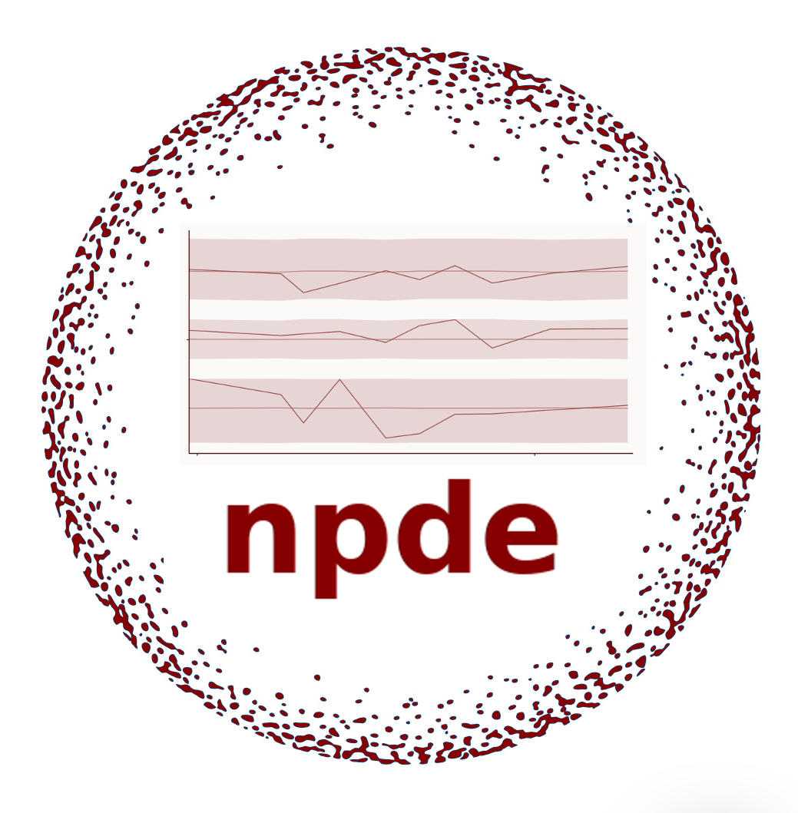

--- 
title: "**npde**: Open Source R normalised prediction distribution errors "
header-includes: 
    \usepackage{natbib}
    \usepackage{xcolor}
author: "Emmanuelle Comets, Karl Brendel, Marc Cerou, Thi Huyen Tram Nguyen,  Romain Leroux, France Mentr\u00E9"
date: "`r Sys.Date()`"
bibliography: [npde_refs.bib, npde_library.bib, book.bib, biblio_fullname.bib]
biblio-style: "apalike"
description: User's guide and documentation for npde package
documentclass: book
link-citations: true
site: bookdown::bookdown_site
output: bookdown::gitbook
extra_dependencies: ["bbm", "amsmath","amssymb","amsthm"]
pdf_document: default
html_document: default
urlcolor: blue
---
 
\newcommand{\Var}{\mathrm{Var}}
\newcommand{\Kurt}{\mathrm{Kurt}}
\newcommand{\Skew}{\mathrm{Skew}}
\newcommand{\ypred}{\mathrm{ypred}}

\newcommand{\pd}{\mathrm{pd}}
\newcommand{\pde}{\mathrm{pde}}
\newcommand{\npd}{\mathrm{npd}}
\newcommand{\npde}{\mathrm{npde}}
\newcommand{\tnpde}{\mathrm{tnpde}}
\newcommand{\Y}{\mathrm{Y}}
\newcommand{\V}{\mathrm{V}}

\setlength{\abovedisplayskip}{0pt}
\setlength{\belowdisplayskip}{0pt}

\renewcommand{\topfraction}{.85}
\renewcommand{\bottomfraction}{.7}
\renewcommand{\textfraction}{.15}
\renewcommand{\floatpagefraction}{.66}
\setcounter{topnumber}{3}
\setcounter{bottomnumber}{3}
\setcounter{totalnumber}{4}
 
# Welcome to the npde package in R {-}

The $\sf{npde}$ project is an R package available in CRAN that provides routines to compute **normalised prediction distribution errors** and **normalised prediction discrepancies**, which are simulation-based residuals designed to evaluate non-linear mixed effect models such as those used in pharmacokinetics and pharmacodynamics. References concerning the methods include the papers [@Brendel06], [@Comets08], [@Nguyen2012], [@Comets21]. 

```{r, fig.cap='', out.width='40%', fig.asp=.75, fig.align='center', echo=FALSE}

```

## User Guide {-}

A comprehensive user guide providing documentation about **npde**, no longer bundled along with the package because of its size, is now available on the GitHub repository <https://github.com/ecomets/npde30/blob/main/userguide_npde_3.1.pdf>.

## Legalese {-}

**npde** is a software distributed under the terms of the GNU GENERAL PUBLIC LICENSE Version 2, June 1991 ( [GPL-2] (<https://cran.r-project.org/web/licenses/GPL-2>) | [GPL-3] (<https://cran.r-project.org/web/licenses/GPL-3>) [expanded from: GPL (>=2)]).  The terms of this license are in a file called COPYING which you should have received with this software.

If you have not received a copy of this file, you can obtain one via the world wide web at <http://www.gnu.org/copyleft/gpl.html>, or by writing to:

\noindent The Free Software Foundation, Inc.,51 Franklin Street, Fifth Floor, Boston, MA 02110-1301, USA.

